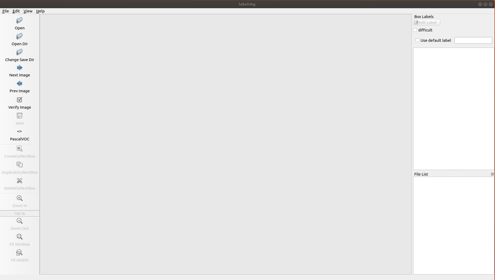
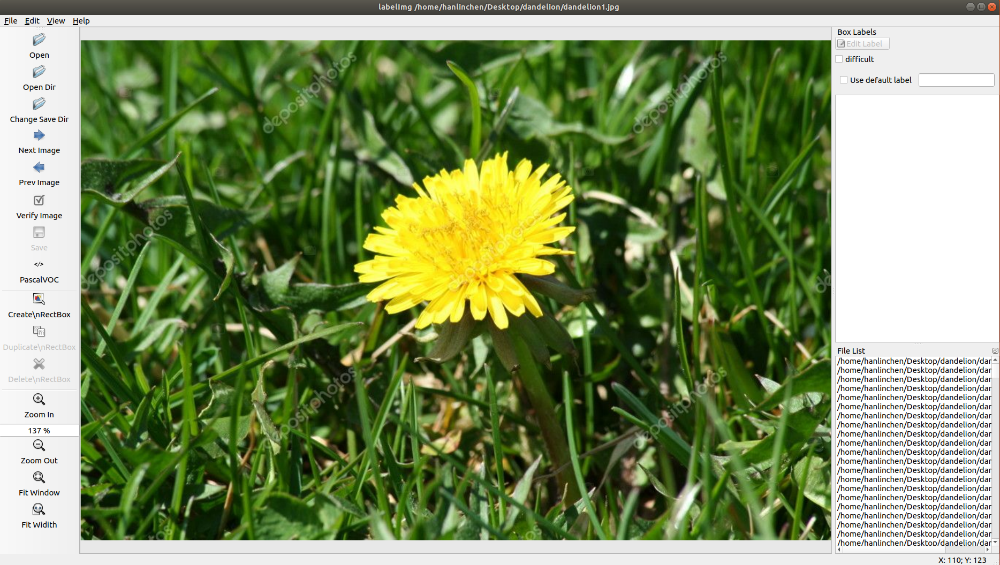
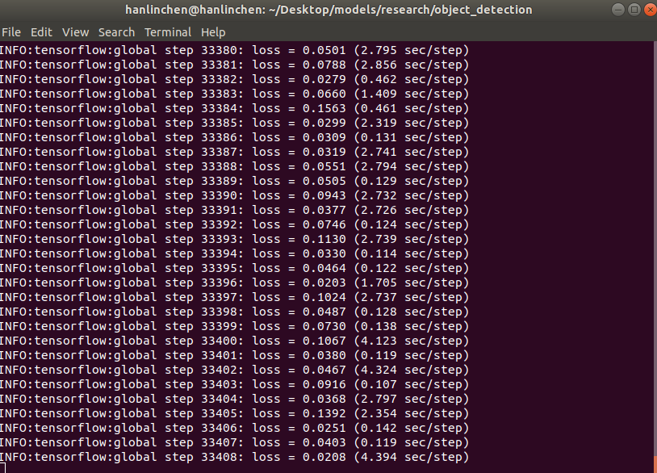
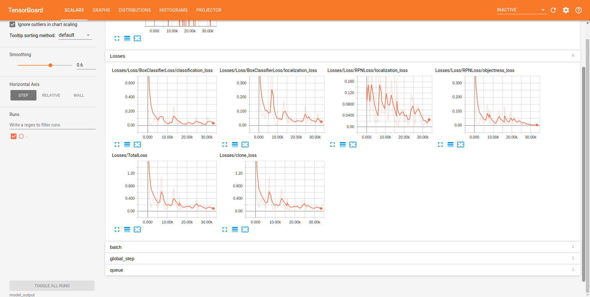

# Weeds Detection Using Tensorflow
## Table of Content
* [Introduction](#Introduction)
* [Environment Requirements](#Environment-Requirements)
* [Prepare and Label Image Data](#Prepare-and-Label-image-data)
* [Generate tfrecord](#Generate-tf-record)
* [Training Tensorflow Model](#Training-The-Model)
* [Export Frozen Inference Graph](#Export-Frozen-Inference-Graph)
* [Usage](#Usage)
## Introduction  
This software is build using tensorflow framework to detect the most common weeds in the rural environment. Due to overhead of GPU memory (6G RTX 2060) on my local desktop, I only trained faster_rcnn_inception_v2_coco from [tensorflow object detection models](https://github.com/tensorflow/models/blob/master/research/object_detection/g3doc/detection_model_zoo.md) with three type of weeds (dandelion, oxalis,buckhorn plantain). you can definitely train the model to detect more weeds on your computer with much better GPU.   The google search engine also built in software allow users to check out solution to kill that specified weed in real time. Here is a quick demo:<br>


## Environment Requirements:
* Linux (Ubuntu)
* cuda >=9.0
* Python >= 3.5
* Tensorflow-gpu>=1.4.0
* PyQt5
* opencv-python3
* pillow 
* jupyter notebook
* matplotlib 


## Prepare and Label image data:
### Download images 
All weed images are located in corresponding directory within [images folder](/images). In case that you want to try out different type of weeds, you can download more images via [google image download](https://pypi.org/project/google_images_download/) (make sure that images are placed in directory under their name within images folder !).

### Label image data
 Download labelImg from [(tzutalin/labelImg)](https://github.com/tzutalin/labelImg), then follow through all procedures and install on your computer. Once all installations are finished, go to labelImg folder and type this command in your terminal:<br>
 ```bash
 $python3 labelImg.py
 ```
After entering above command,  A GUI window will pop up like this:<br>



Click the Open Dir and load all images into window. Once this is done, the bottom right corner will list all uploaded images<br>


Click Create\nRectBox (<b>Keep PascalVOC format !!!</b>) and start to label image.<br>


After the image is labeled, and press Ctr+S to save all labeled data into xml file. after it is saved, Click Next images and repeat same process<br>


## Generate tfrecord:
 Split all labeled images along with their xml files(20% for training and 80% for testing) and place them into [test](images/test) and [train](images/train) in images folder. And convert all *.xml to csv files by running python scripts from your terminal:

```bash
$python3 xml_to_csv.py  
```
Now we need to create [weed label map](/data/weed_label.pbtxt) in data folder:
```pbtxt
item{

    id:1
    name: 'buckhorn plantain'
    display_name: 'buckhorn plantain'
}

item{

    id:2
    name: 'dandelion'
    display_name: 'dandelion'
}

item{

    id:3
    name: 'oxalis'
    display_name: 'oxalis'
}
```


Before generating tfrecord file, place following codes in the function called <b>class_text_to_int</b> in [generate_tfrecord.py](/generate_tfrecord.py) (<b>same as label map we just created</b>) 

```python
def class_text_to_int(row_label):
    
    if row_label == 'buckhorn plantain':
        return 1
    elif row_label == 'dandelion':
        return 2
    elif row_label == 'oxalis':
        return 3
    else:
        None
```
Next, generate tf record file for test and train data just by run python script from your terminal:
```bash
$python3 generate_tfrecord.py\
        --csv_input=data/test_labels.csv\
        --output_path=data/test.record\
        --image_dir=images/test/

$python3 generate_tfrecord.py\ 
         --csv_input=data/train_labels.csv\
         --output_path=data/train.record\ 
         --image_dir=images/train/
```
After running above scripts, the tfrecod file for both train and test should be located in [data](data/) folder.


## Training The Model:

To train tensorflow model, git clone https://github.com/HarryChen1995/tensorflow_model_API or download the .zip and extract it to your desktop. Then go to [research](https://github.com/HarryChen1995/tensorflow_model_API/tree/master/research) folder and compile object_detection with protobuf by enter following command from terminal:
```bash
$ protoc object_detection/protos/*.proto --python_out=.
```
then export slim python path 
```bash
$ export PYTHONPATH=$PYTHONPATH:`pwd`:`pwd`/slim
```
Note: this command need to run for every time you start new terminal.
 To avoid running manually, placing following bash script in your ~/.bashrc:
 ```bash
 export PYTHONPATH=$PYTHONPATH:/home/username/Desktop/tensorflow_model_API/research:/home/username/Desktop/tensorflow_model_API/research/slim
 ```
 and compile ~/.bashrc from terminal:
 ```bash
 $ source ~/.bashrc
 ```
Finally install tensorflow model API by enter following command in research folder:
```bash
$python3 setup.py install
```
Now we need to download physical model (faster_rcnn_inception_v2_coco) from  [Tensorflow detection model zoo](https://github.com/tensorflow/models/blob/master/research/object_detection/g3doc/detection_model_zoo.md) and extract it to [object detection folder](https://github.com/HarryChen1995/tensorflow_model_API/tree/master/research/object_detection).

Next, copy [data](/data) and [training](/training) folder to [object detection folder](https://github.com/HarryChen1995/tensorflow_model_API/tree/master/research/), then proceed to train model by entering following command from terminal within  [object detection folder](https://github.com/HarryChen1995/tensorflow_model_API/tree/master/research/object_detection):
```bash
$python3 train.py --logtostderr --train_dir=model_output/ --pipeline_config_path=training/faster_rcnn_inception_v2_coco.config 
```
Note: it may take up to 30-60 seconds to initialize tensorflow, Once initialization finished, the training output for each step will be displayed in terminal:


Depend on GPU and CPU of your computer, the whole training process may take up to couple hours.  I recommend allowing to train your model until the loss get down below 0.05. After training is finished, you can check total loss of model through tensorboard by running following command within  [object detection](https://github.com/HarryChen1995/tensorflow_model_API/tree/master/research/object_detection) folder:
```bash
$ tensorboard --logdir=model_output
```
Then open your browser and go to localhost:6006, the loss will be displayed along with its each training step in browser:

 

# Export Frozen Inference Graph:

Once the training is completed, then generate inference model by enter following command from terminal within [object detection](https://github.com/HarryChen1995/tensorflow_model_API/tree/master/research/object_detection) folder:

```bash
    python3 export_inference_graph.py \
    --input_type image_tensor \
    --pipeline_config_path training/faster_rcnn_inception_v2_coco.config \
    --trained_checkpoint_prefix \model_output\model.ckpt-latest_checkpoints \
    --output_directory weed
```
After this, the last step is to  move weed folder into weed_detections folder <b>(we are done finally !!!!)</b>


## Usage:

To run software and enter following command from terminal within weed_detections folder
```bash
$python3 user_gui.py
```
